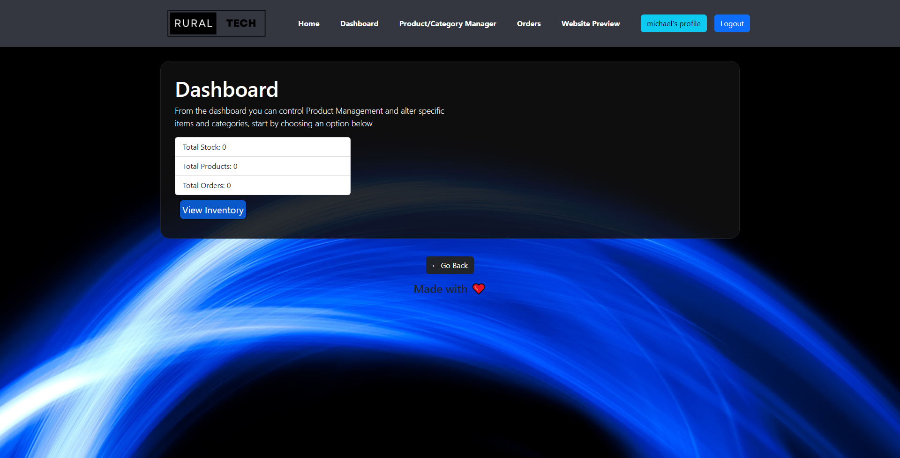

 

### **Table of Contents**  
***
 [**About**](#about) 
 [**Future Development**](#future-development) 
 [**Installation**](#installation) 
 [**Usage**](#usage) 
 [**Links**](#links) 
 [**Contributer**](#contributer) 
 [**Contact**](#contact) 
 [**Licence Information**](#licence) 
 [**Demo**](#demo) 

## **About**
Rural tech is a template e-commerce website that demonstrates the possibility of creating a tool for business owners to handle inventory tasks such as:
<li> creating products and categories</li>
<li>assigning products to categories</li>
<li>updating existing products</li>
<li>updating existing products and catergories</li>
<li>deleting products and categories</li>
 
By implementing create, read, update and delete operations for products and categories, we’ve been able to empower administrators to efficiently manage the platforms inventory.
Whether it's adding new products, updating existing ones, or organizing them into relevant categories, our admin interface simplifies these tasks, saving valuable time and effort.

 

***

***

## **Future Development**
Rural Tech’s Minimum Viable Product serves as a foundation for future enhancements and features. Moving forward, I envision integrating additional functionalities such as:
<li>Subscription Service for new products.
<li>Additional statistics for admin dashboard.
<li>Product recommendations
<li>Customer feedback form

***

## **Usage**
N/A

***

## **Links**
[Github Link](#https://github.com/Zim40/RuralTech-Ecommerce-)
 
[Heroku Application](#https://safe-eyrie-03718.herokuapp.com/login)

## **Contributers**
**Starter code provided by:** *Ben Fawcett* - TA, Adelaide University Coding Bootcamp 
**Project developed by:** [Michael Monaghan](#https://github.com/Zim40?tab=repositories)
## **Contact**
For enquires please email [*Michael Monaghan*](mailto:michaelm810129@gmail.com)

## **Licence**

